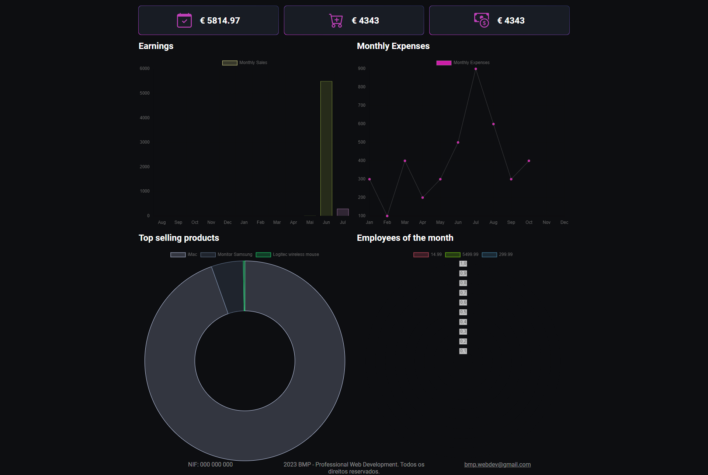

<h1 align="center">Welcome to Django Dashboard App 👋</h1>
<!-- <p>
  
</p> -->

> A dashboard for sales data visualization and analysis.
> It is built with Django and Chart.js.

## Author

👤 **Bruno Pais**

* Website: <https://www.linkedin.com/in/bruno-pais-webdev/>
* Github: [@BrunoMSPais](https://github.com/BrunoMSPais)
* LinkedIn: [@bruno-pais-webdev](https://linkedin.com/in/bruno-pais-webdev)

## Purpose

> This project serves as a way to practice Django and Chart.js.<br>
> The final goal is to have a complete CRM app with customized dashboards and data visualization pages for a variety of corporate needs.

## Requirements

> This project requires the following:
>
> * Python 3.8.5
> * Django 3.1.2

## Installation
  
  ```sh
  git clone
  cd django-dashboard-app
  pip install -r requirements.txt
  python manage.py runserver
  ```

## Usage

> This project is not yet ready for production.

## Screenshots



## Technologies

<p align="left">
  <a href="https://www.python.org" target="_blank" rel="noreferrer">
    
  </a>
  <a href="https://www.djangoproject.com/" target="_blank" rel="noreferrer">
    
  </a>
  <a href="https://www.w3schools.com/css/" target="_blank" rel="noreferrer">
    
  </a>
  <a href="https://www.w3.org/html/" target="_blank" rel="noreferrer">
    
  </a>
  <a href="https://developer.mozilla.org/en-US/docs/Web/JavaScript" target="_blank" rel="noreferrer">
    
  </a>
  <a href="https://www.sqlite.org/" target="_blank" rel="noreferrer">
    
  </a>
</p>

## Credits

> [pythonando - DASHBOARD com DJANGO e CHART.JS](https://external.ink?to=/www.youtube.com/watch?v=HozwGeEiXIk)

## Show your support

Give a ⭐️ if this project helped you!

***

## Next Steps

* [ ] 1. Add expenses table to admin;
* [ ] 2. Add more data;
* [ ] 3. Dynamically present values for Total Expenses and Total Income (top-middle value);
* [ ] 4. Add dynamic data to the Monthly Expenses chart (top-right value);
* [ ] 5. Add costumers data;
* [ ] 6. Add suppliers data;
* [ ] 7. Add staff management page;
* [ ] 8. Add sales page;
* [ ] 9. Add expenses page;
* [ ] 10. Add customers page;
* [ ] 11. Add products page;
* [ ] 13. Add sidebar;
* [ ] 14. Add user to data;
* [ ] 15. Add landing page;
* [ ] 16. Add login/subscribe page;
* [ ] 17. Add import data from CSV file functionality;
* [ ] 18. Publish;

***
_This README was partially generated with ❤️ by [readme-md-generator](https://github.com/kefranabg/readme-md-generator)_
